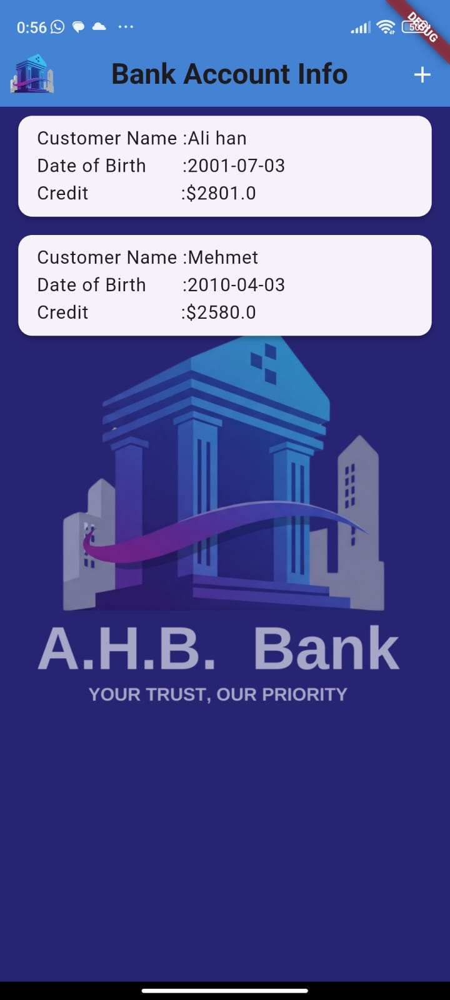
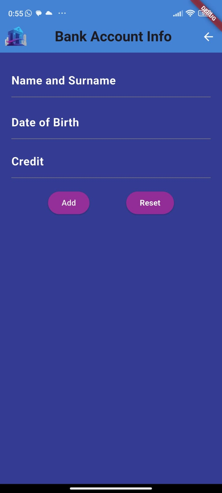
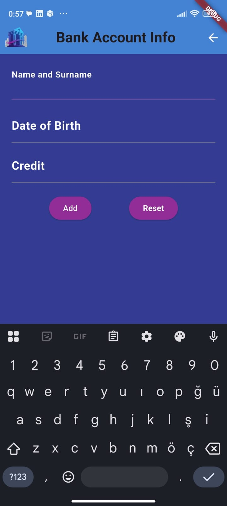
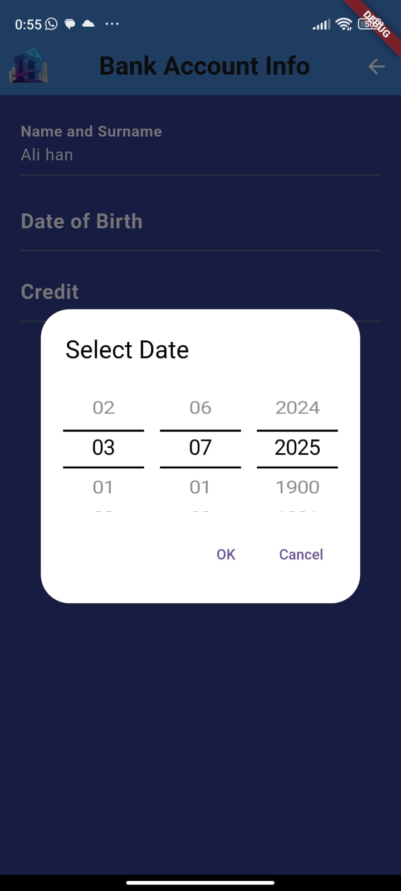
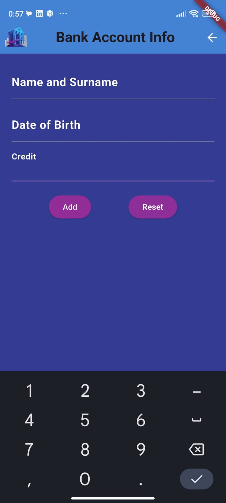
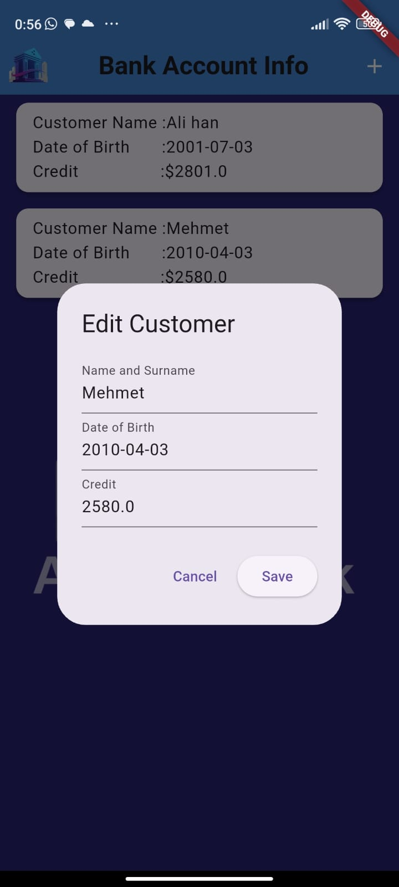
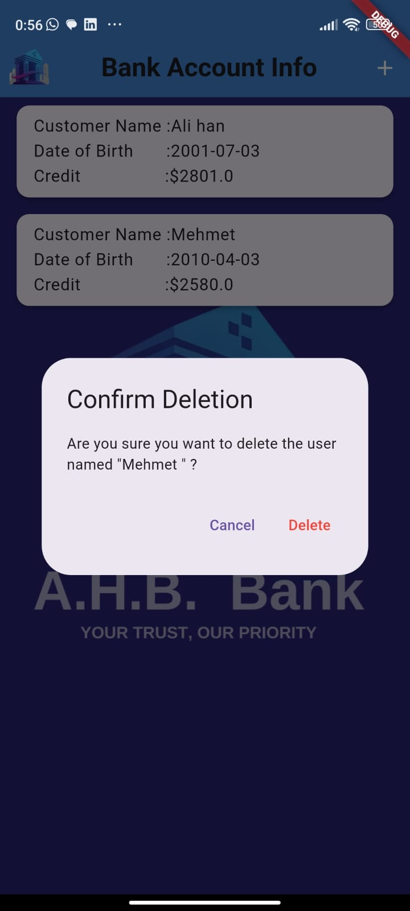

# BankApp
 
It is a simple banking application developed with Flutter. It simulates basic banking operations with a user-friendly interface.

## Features
* View account balance

* Add new user

* Edit added data

* User-friendly design

## Applications Image

<table align="center">
  <tr>
    <td align="center">
       
      <b>Main Menu</b>
    </td>
        <td align="center">
       
      <b>Customer Add Page</b>
    </td>
    <td align="center">
       
      <b>Customer Name Input</b>
    </td>

  </tr>
  <tr>
        <td align="center">
       
      <b>Select Date</b>
    </td>
    <td align="center">
       
      <b>Credit Input</b>
    </td>
    <td align="center" >
       
      <b>Edit Customer</b>
    </td>

  </tr>
  <tr>
     <td align="center"colspan="3">
       
      <b>Customer Deletion</b>
    </td>
  </tr>
</table>

## Setup
1- Install the required packages:
  
  flutter pub get  

2- Run the application:

  flutter run  
